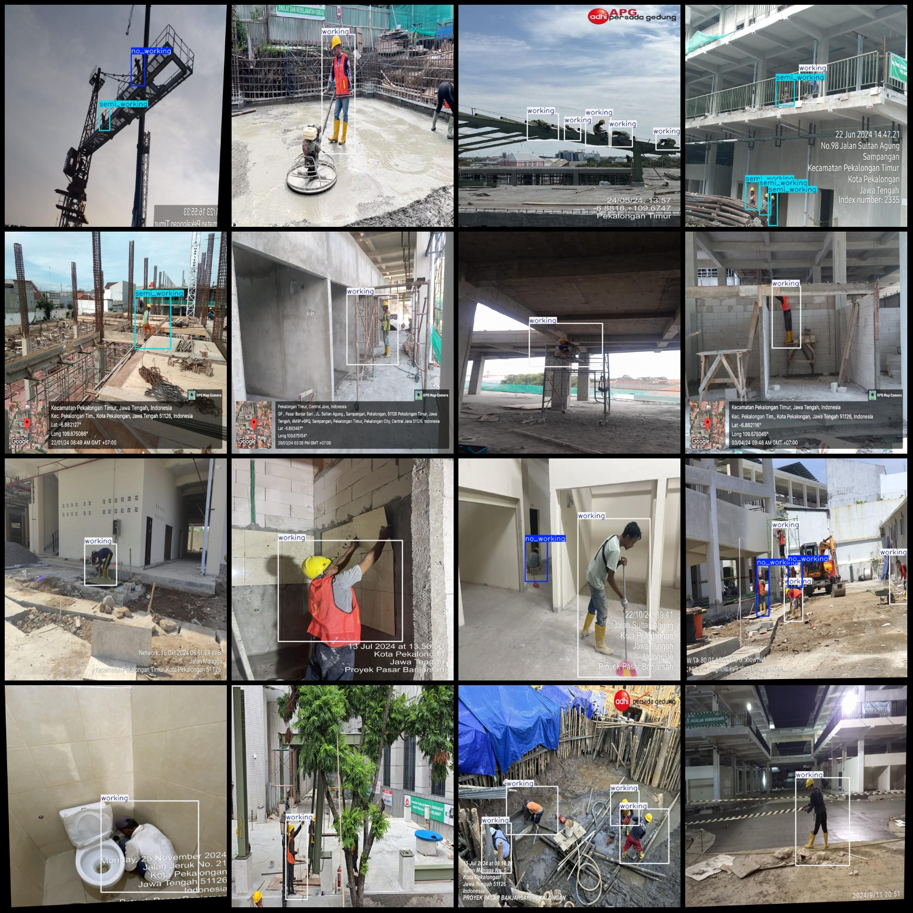
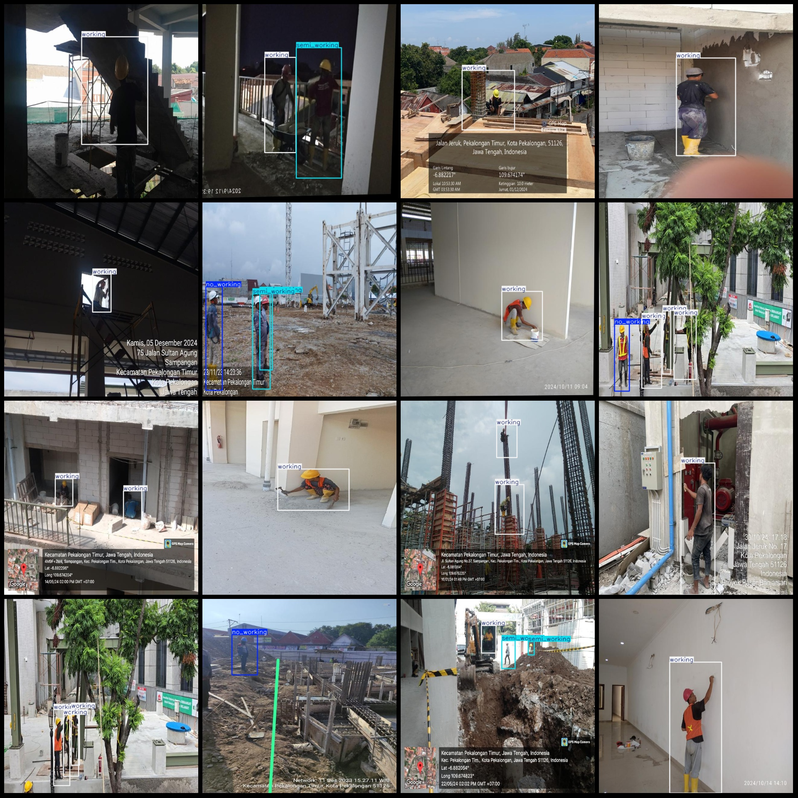

# Smart Construction Worker Work State Detection Data Set (VOC+YOLO format, 7375 images, 3 categories)

Note: Some enhancements are included in the dataset, approximately 5000 of which are original images, with the remaining being rotated enhancement images.

Dataset format: Pascal VOC format + YOLO format (without split paths in the txt file, only containing jpg images and corresponding VOC format xml files and yolo format txt files).

Number of images (jpg files): 7375
Number of annotations (xml files): 7375
Number of annotations (txt files): 7375
Number of annotation categories: 3
Annotation category names (note that the order of categories in the yolo format is not consistent with this, but refer to the labels folder's classes.txt for consistency): ["no_working", 
"semi_working", "working"]
Number of bounding boxes per category:
- No working (non-working state) = 4145
- Semi working (semi-working state) = 5974
- Working (working state) = 8590
Total number of bounding boxes: 18709
Number of images per category:
- No working occupies images = 1943
- Semi working occupies images = 2778
- Working occupies images = 5300
Image resolution: 640x640
Annotation tool used: labelImg
Annotation rule: draw rectangle boxes for the categories
Important notes: The dataset does not have a division into training, validation, or test sets; you will need to divide it yourself.
Special declaration: This dataset does not guarantee any accuracy of the trained models or weight files.
Image preview:
Annotation example:

## Images

Here is a pay link on Stripe ( https://buy.stripe.com/3cs8yP7sY87d0vu9AB ). Please contact me lonlonago@foxmail.com after funding $89, and I will send you a complete data files , thank you!

